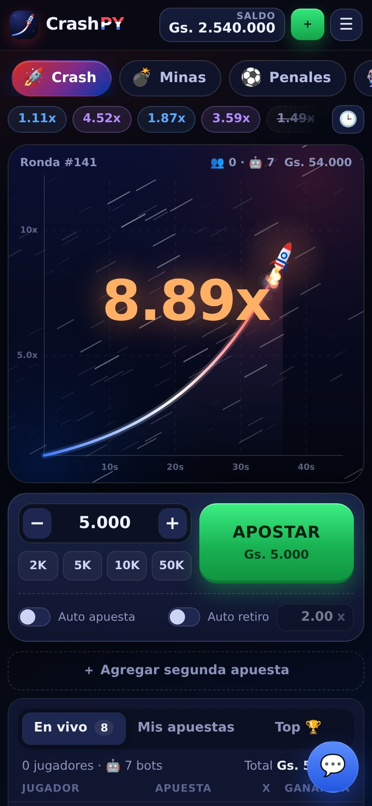
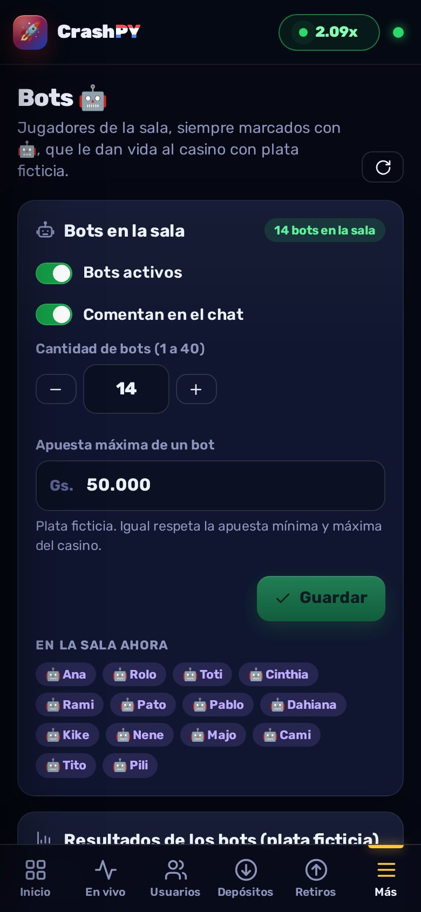
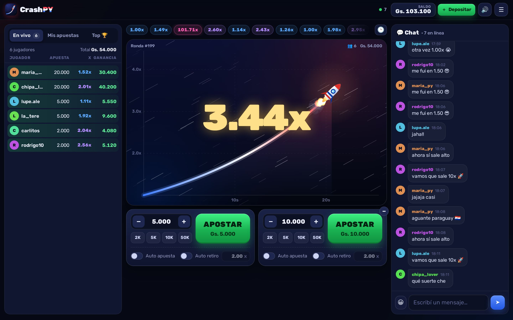

# 🚀 CrashPY — el crash paraguayo en tiempo real

Juego **Crash** multijugador en **guaraníes (PYG)** que corre en tu PC y se juega desde el celular a través de **Cloudflare Tunnel**.
Incluye resultados **comprobables (provably fair)**, **chat**, **depósitos y retiros por transferencia** y un **panel de administración en tiempo real**.

<p align="center">
  
  
</p>



## ✨ Qué trae

**Para los jugadores**
- Cohete con animaciones, estelas, explosión, sonidos y vibración en el celular.
- Multiplicador en tiempo real (2x ≈ 11,5 s, 10x ≈ 38 s) y **retiro en cualquier momento**.
- **2 apuestas por ronda**, **retiro automático** (funciona aunque se corte internet) y **apuesta automática**.
- Apuestas en vivo de todos, historial de rondas, "Mis apuestas", **Top ganadores** del día / semana / mes.
- **Chat** con emojis, anuncios del admin y avisos automáticos de ganancias grandes.
- **Billetera**: depositar por transferencia (con foto del comprobante), retirar a cualquier banco o billetera, movimientos y estado de solicitudes.
- Se puede **instalar como app** en el celular ("Agregar a pantalla de inicio").
- Página **/fair** para verificar cualquier ronda (SHA-256), sin depender del servidor.

**Para el administrador (`/admin`)**
- Tablero en vivo: conectados, qué apuesta cada uno, ganancia de la casa por hora/día, actividad.
- **Ronda en vivo** con todas las apuestas, botón **💥 Explotar ahora** y **⏸ Pausar / ▶ Reanudar**.
- **Usuarios**: buscar, ver ficha completa, **editar saldo** (sumar / restar / fijar), suspender, silenciar en el chat, cambiar contraseña, cuentas con la misma IP.
- **Depósitos** (con foto del comprobante) y **retiros** (con datos bancarios para copiar): aprobar / rechazar con un toque. Avisos con sonido.
- **Chat**: borrar mensajes, silenciar, anuncios.
- **Configuración**: apuestas mínimas/máximas, ganancia máxima, tiempo para apostar, datos bancarios, WhatsApp de soporte, bono de bienvenida…
- **Auditoría**: todo lo que hace cada admin queda registrado. **Libro contable**: cada guaraní que entra o sale queda anotado.
- **Respaldos** automáticos de la base de datos cada 6 horas y descarga manual.

---

## 🖥️ Instalación en Windows (paso a paso)

1. **Instalá Node.js** (versión **LTS**, 22.13 o superior) desde <https://nodejs.org>. Siguiente → Siguiente → Instalar.
2. **Descargá este proyecto** (botón verde *Code → Download ZIP* en GitHub) y descomprimilo, por ejemplo en `C:\CrashPY`.
3. Hacé **doble clic en `INICIAR.bat`**.
   - La primera vez instala lo necesario (tarda un minuto).
   - En la ventana aparece el **usuario y contraseña del administrador** (también queda guardado en `data\ADMIN-INICIAL.txt`).
   - Si Windows pregunta por el firewall, tocá **Permitir acceso**.
4. Abrí en el navegador **<http://localhost:3000>** para jugar y **<http://localhost:3000/admin>** para el panel.
5. En el panel entrá a **Configuración** y cargá tus **datos bancarios** (banco, titular, CI/RUC, cuenta, alias) — eso es lo que ven los jugadores al depositar. Cambiá también la contraseña del admin.

> Si querés elegir vos la contraseña del admin antes del primer arranque, copiá `.env.example` como `.env` y completá `ADMIN_PASS=`.

### Probar desde el celular en tu casa (misma WiFi)
Cuando arranca, la ventana muestra una línea **"En tu WiFi (cel): http://192.168.x.x:3000"**. Abrí esa dirección en el celular.

---

## 🌐 Jugar desde internet con Cloudflare Tunnel

Cloudflare Tunnel conecta tu PC con internet **sin abrir puertos en el router** y con **HTTPS** automático.

### Con tu dominio (ej. `https://crash.alexlamasg.lat`) — todo automático
Necesitás el dominio agregado a tu cuenta de Cloudflare (plan gratis). **No hace falta crear nada en el panel de Cloudflare ni buscar tokens.**

1. Abrí `INICIAR.bat` (el juego tiene que estar corriendo).
2. Abrí **`TUNEL-CLOUDFLARE.bat`** y elegí la opción **1**. Si no tenés `cloudflared`, el script lo instala solo.
3. Confirmá el dominio con Enter (toma el de `PUBLIC_URL` en `.env`; por defecto `crash.alexlamasg.lat`).
4. Se abre el navegador con Cloudflare: iniciá sesión, **tocá tu dominio** (`alexlamasg.lat`) y **Authorize**. Volvé a la ventana negra.
5. El script crea solo el túnel `crashpy-pc` y el registro DNS, y conecta. Cuando aparezca `Registered tunnel connection`, entrá a **https://crash.alexlamasg.lat** 🎉 (panel: `/admin`).

Las próximas veces solo abrís `TUNEL-CLOUDFLARE.bat` y se conecta directo.

**Para que arranque solo con la PC:** doble clic en **`ARRANQUE-AUTOMATICO.bat`**. Cada vez que inicies sesión en Windows se abren minimizados el juego y el túnel. Si lo volvés a abrir, te ofrece desactivarlo.

> ⚠️ `cloudflared-config.yml`, `cloudflared-cred.json` y `cloudflared-token.txt` son las llaves de tu túnel: no los compartas (ya están excluidos de GitHub en `.gitignore`).
> Si antes creaste un túnel desde el panel de Cloudflare (por ejemplo `crashpy`) y no lo usás, lo podés borrar desde *Tunnels*; no molesta.

### Otras opciones del mismo script
- **Opción 2 — pegar un token:** si creaste el túnel desde el panel de Cloudflare y tenés el comando `cloudflared.exe service install eyJ...`, pegalo entero. En ese caso la ruta pública (`crash` → `http://localhost:3000`) se configura en el panel del túnel.
- **Opción 3 — túnel rápido de prueba:** te da una dirección `https://palabras-al-azar.trycloudflare.com` sin cuenta. Cambia cada vez que lo abrís.

**Para volver a configurar** (otro dominio u otra cuenta): borrá `cloudflared-config.yml` (y `cloudflared-token.txt` si existe) y abrí `TUNEL-CLOUDFLARE.bat` de nuevo.

> Los WebSockets (tiempo real) funcionan con Cloudflare sin configurar nada extra.
> Recomendado: en Cloudflare activá **"Always Use HTTPS"**.

---

## 💸 Cómo funciona la plata

Todo se maneja en **guaraníes enteros** y **cada cambio de saldo queda en el libro contable** (tipo, monto, saldo resultante, quién lo hizo y por qué).

**Depósito**
1. El jugador toca **Depositar**, ve tus datos bancarios y transfiere desde su banco o billetera.
2. Completa el monto, el número de comprobante y sube la **captura**.
3. Te aparece en **Admin → Depósitos** con aviso sonoro. Revisás tu cuenta y tocás **Aprobar** (podés corregir el monto) o **Rechazar** con un motivo.
4. Al aprobar, el saldo se acredita al instante y el jugador recibe una notificación.

**Retiro**
1. El jugador pide un retiro con su banco, cuenta/alias, titular y CI. **El monto se descuenta en ese momento** (queda reservado).
2. En **Admin → Retiros** copiás los datos, hacés la transferencia desde tu banco y tocás **Marcar pagado**.
3. Si lo rechazás, **el saldo se le devuelve automáticamente**.

**Ajustes manuales**: en la ficha de cada usuario podés **sumar, restar o fijar** el saldo (por ejemplo, un depósito que te mandaron por WhatsApp). Siempre queda registrado con el motivo.

**Ganancia de la casa**: viene de la **ventaja matemática** (por defecto **3 %**, RTP 97 %, como Aviator). En el largo plazo la casa se queda con ~3 % de todo lo apostado. Además podés limitar:
- **Apuesta máxima** y **ganancia máxima por apuesta** (al llegar al tope se retira sola).

---

## 🔐 Provably fair (juego comprobable)

- Al instalar se genera una **cadena de 1.000.000 de hashes SHA-256** y se publica el **hash terminal** en `/fair` antes de jugar.
- Cada ronda usa el hash anterior de la cadena: `SHA256(hash de la ronda) = hash de la ronda anterior`. Nadie puede saber el próximo resultado ni cambiarlo.
- El punto de explosión sale de una fórmula pública:
  ```
  hmac  = HMAC_SHA256(clave = sal, mensaje = hash)
  X     = primeros 52 bits de hmac / 2^52
  crash = floor((100 − ventaja%) / (1 − X)) / 100     (mínimo 1.00x)
  ```
- Tocando cualquier ronda del historial se ve su hash y se verifica en el mismo celular.
- Para **cambiar la ventaja de la casa**: *Admin → Provably fair → Generar cadena nueva*. Se aplica desde la próxima ronda y la semilla de la cadena vieja se publica.

### 💥 Sobre el botón "Explotar ahora"
El admin puede detener una ronda en vuelo en cualquier momento (por ejemplo si hay un problema). Para que el juego siga siendo **honesto y verificable**, al detenerla elegís:
- **Devolver apuestas**: la ronda se anula y cada jugador recupera lo que apostó.
- **Pagar a todos al multiplicador actual**: todos cobran como si hubieran retirado en ese momento.

La ronda queda marcada como **anulada** en el historial público junto con su hash. Así **nadie pierde plata por una intervención manual** y el sistema sigue siendo comprobable.

> ¿Por qué no hay un botón para "hacer perder" a propósito? Porque con dinero real sería una estafa a los jugadores, y además el sistema de hashes lo delataría: cualquiera podría demostrar que la ronda no coincide con su hash. La ganancia de la casa sale de la ventaja matemática, que es lo que usan todos los casinos serios.

---

## 🛡️ Seguridad y respaldos

- Contraseñas guardadas con **scrypt**; sesiones con cookies `HttpOnly`.
- Límites contra abuso (intentos de login, registros, mensajes, acciones por segundo).
- El punto de explosión **nunca** se envía antes de que la ronda termine.
- Si el servidor se apaga o se corta la luz en medio de una ronda, al volver **la ronda se anula y se devuelven las apuestas**.
- **Respaldos**: se guarda una copia de la base de datos cada 6 horas en `data\backups\` (se conservan los últimos 30). También podés descargar una desde *Admin → Configuración → Respaldos*.
  👉 **Copiá la carpeta `data` a un pendrive o a la nube de vez en cuando.** Ahí está todo: usuarios, saldos, apuestas y comprobantes.
- No compartas la carpeta `data` ni el archivo `.env`.

## ⏰ Para tenerlo abierto 24/7

- En Windows: *Configuración → Sistema → Inicio/apagado y suspensión* → **Suspender: Nunca** (si la PC se duerme, el juego se corta).
- Hacé doble clic en **`ARRANQUE-AUTOMATICO.bat`**: el juego y el túnel se abren solos cada vez que iniciás sesión en Windows.
- Si podés, conectá la PC por cable y con una UPS. Si igual se corta la luz en medio de una ronda, al volver se devuelven las apuestas de esa ronda.

## 🧰 Problemas comunes

| Problema | Solución |
|---|---|
| "Necesita Node.js 22.13 o superior" | Instalá la versión LTS de <https://nodejs.org> y reiniciá la PC. |
| "El puerto 3000 ya está en uso" | Ya hay otra ventana de CrashPY abierta. Cerrala o cambiá `PORT` en `.env` (y usá el mismo en el túnel). |
| Me olvidé la contraseña del admin | Con el servidor apagado ejecutá `npm run reset-admin -- NuevaClave123` en la carpeta del proyecto. |
| El celular no entra por WiFi | Permití "Node.js" en el Firewall de Windows (Redes privadas) y verificá que estén en la misma red. |
| La dirección trycloudflare cambió | Es normal en el túnel rápido (opción 3). Usá la opción 1 (tu dominio) para una dirección fija. |
| Cloudflare muestra **Error 1033** | El túnel no está conectado: abrí `TUNEL-CLOUDFLARE.bat` y esperá `Registered tunnel connection`. |
| Cloudflare muestra **502 Bad Gateway** | El túnel funciona pero el juego no: abrí `INICIAR.bat` y revisá que el túnel apunte a `localhost:3000` (el mismo `PORT` del `.env`). |
| El juego queda en "Reconectando…" por internet | En Cloudflare → tu dominio → **Network**: **WebSockets** activado. Y no uses el modo *Under Attack* para este subdominio. |
| Querés rehacer la configuración del túnel | Borrá `cloudflared-config.yml` y `cloudflared-token.txt` y abrí `TUNEL-CLOUDFLARE.bat` de nuevo. |

## ⚖️ Aviso legal

Los juegos de azar con dinero real están regulados. En Paraguay la explotación de juegos de suerte o azar requiere autorización de la **CONAJZAR** (Ley N.º 1016/97). Operar sin habilitación puede traer consecuencias legales. Este software se entrega como herramienta; **el cumplimiento de la ley, la verificación de mayoría de edad y el juego responsable son responsabilidad de quien lo opere**. Solo para mayores de 18 años.

---

## 👩‍💻 Para desarrolladores

```
npm install        # dependencias (express, socket.io)
npm start          # servidor en http://localhost:3000
npm run dev        # reinicia solo al guardar cambios
npm test           # pruebas automáticas (apuestas, retiros, saldos, provably fair)
```

- **Servidor**: Node.js + Express 5 + Socket.IO + SQLite integrado (`node:sqlite`, sin compilar nada).
- **Frontend**: HTML/CSS/JS sin frameworks ni build (`public/`), animación en `<canvas>` y sonidos con WebAudio.

```
server/
  index.js        arranque, HTTP, seguridad
  game.js         motor del juego (fases, apuestas, retiros, explosión, controles admin)
  fair.js         cadena de hashes y fórmula del punto de explosión
  wallet.js       saldos, libro contable, depósitos, retiros, ajustes
  sockets.js      tiempo real (jugadores y /admin)
  routes/         API REST pública y de administración
public/
  index.html      juego · admin.html panel · fair.html verificación
  js/ css/ img/
data/             base de datos, comprobantes y respaldos (se crea sola)
```
